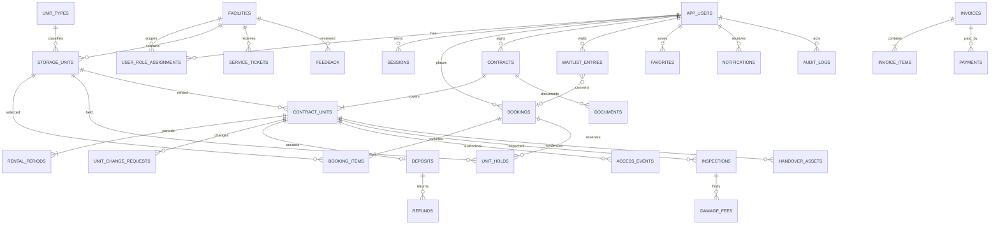

# Schema hệ thống cho thuê kho

Migration: `apps/api/src/migrations/1789776000002-AddStorageRentalBusinessSchema.ts`

## Quyết định chính

- 29 bảng nghiệp vụ, dùng UUID và `timestamptz`; tiền dùng `numeric(14,2)`.
- Khóa chính UUID của 29 bảng mới dùng `uuid_generate_v7()`: 48 bit đầu là Unix timestamp theo millisecond, version 7, RFC variant và các bit còn lại lấy ngẫu nhiên từ `gen_random_uuid()`, không phụ thuộc extension UUIDv7 bên ngoài.
- `storage_items` và `storage_locations` cũ bị drop; `down()` tạo lại schema cũ nhưng không khôi phục dữ liệu.
- `app_users` chỉ là identity: email unique theo `lower(email)`, `password_hash` nullable, cặp `oauth_provider`/`oauth_subject` (unique, 1 provider/user), `email_verified_at`.
- `sessions` lưu `session_token_hash` (hash, không lưu token thô), `user_agent`, `ip_address`, `expires_at`, `last_used_at`, `revoked_at` — hỗ trợ revoke và đa thiết bị.
- Vai trò và permission được ánh xạ cố định trong mã ứng dụng; database không có role/permission tùy chỉnh hay permission template.
- `user_role_assignments.role` chỉ nhận 5 mã cố định: `CUSTOMER`, `FACILITY_STAFF`, `FACILITY_MANAGER`, `OPERATIONS_MANAGER`, `ADMIN`. `CUSTOMER`/`OPERATIONS_MANAGER`/`ADMIN` có `facility_id IS NULL`; `FACILITY_STAFF`/`FACILITY_MANAGER` bắt buộc có `facility_id`.
- Hai partial unique index tách phạm vi toàn cục và theo cơ sở để ngăn phân vai trùng lặp đúng với cách PostgreSQL xử lý `NULL`.
- Cơ sở có địa chỉ và tọa độ. `storage_units` có `zone` và `pos_x`/`pos_y` (bắt buộc đi đôi); trạng thái kho là state machine do service enforce.
- `unit_types` là master data về kích thước/giá; giá và cọc được snapshot tại booking, hợp đồng, kỳ thuê và hóa đơn.
- Một booking/hợp đồng chứa nhiều kho. Partial unique index bảo đảm mỗi kho chỉ có một hold đang hoạt động; thời hạn 15 phút do service tạo `expires_at`.
- Gia hạn tạo `rental_periods` mới (`kind` = `INITIAL`/`RENEWAL`). Đổi kho = contract_unit cũ `ENDED` + contract_unit mới; quy trình duyệt, giai đoạn dùng đồng thời, chênh lệch tiền và lịch sử trong `unit_change_requests`.
- Trạng thái suy ra từ thời gian không lưu DB: invoice quá hạn derive từ `due_at`, hợp đồng sắp hết derive từ `end_at` (đã bỏ `OVERDUE`/`EXPIRING` khỏi enum).
- `feedback` mặc định `PENDING` chờ duyệt.
- Payment được mô phỏng nhưng vẫn tách invoice, payment, deposit và refund để quyết toán rõ ràng.
- Tệp/ảnh nghiệp vụ lưu URL và metadata JSONB, không lưu binary trong PostgreSQL.
- Master data chính có `deleted_at`; dữ liệu giao dịch và audit không bị xóa mềm để giữ lịch sử.

## ERD rút gọn

## Quy tắc cần thực thi ở transaction/service

- Khóa các `storage_units` khi tạo/xác nhận hold nhiều kho; chỉ xác nhận nếu toàn bộ hold còn hiệu lực.
- Job định kỳ chuyển hold hết hạn thành `EXPIRED` và cập nhật kho phù hợp về `AVAILABLE`.
- Overlap của `contract_units` và `rental_periods` đã chặn bằng exclusion constraint ở DB; service vẫn kiểm tra unit đang `RENTED` trước khi tạo hold.
- Đồng bộ trạng thái kho theo state machine nghiệp vụ; database chỉ giới hạn tập giá trị hợp lệ.
- Khi hoàn cọc, khóa bản ghi deposit và bảo đảm tổng refund không vượt phần cọc còn giữ.
